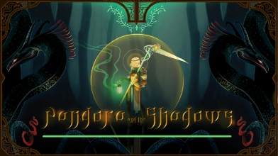

# Reply Code Challenge 2022 Edition - March 10th
### What is «Pandora»?
Pandora is the **name** of Reply Code Challenge 2022 **problem statement**.  
**Our team** - which consists of me and [**Kyumar**](https://github.com/Kyumar) - **joined** the challenge and **coded this solution**.
### Then what's Reply Code Challenge?
The *Reply Code Challenge* (created in 2019) is a challenge 
where, for over **four hours**, participants from 
**all over the world** come together each year to **solve 
algorithm-based problems**, using **any** programming language.
  
Below you can read the abstract and the full problem statement,
to try developing yourself a solution or simply understanding 
what we did.

# Pandora’s Adventures in Replyland



**Abstract**

In the fantasy world of Replyland, legend says that in ancient 
times the Gods hid a jar in a cave, on the peak of the highest 
mountain. No one knew what was in the jar. Some said it 
contained eternal fortune, others terrible disgrace. 
Only one man dared to climb the mountain and take the jar: 
**Epimetheus**. He was power-hungry and imagined the jar 
would give him the ability to defeat anyone.

Once back in his village, he gathered everyone in the square 
and opened the jar. From it a shadow emerged and exploded into 
thousands of pieces that were scattered across Replyland. 
The sky thundered and a godly voice bellowed: “You dared to 
open the jar and free all the evils and sins ever known. 
Only a true hero can gather all the demons and put them back 
into the jar”.  
**Pandora**, Epimetheus’ **wife**, emerged from the 
crowd and said: “My husband was that foolish to challenge the 
Gods and open the sacred jar. I will challenge the demons to 
restore the balance.” Everyone knew and respected Pandora: 
she was a devotee to the magic of light and nature, 
and a very powerful healer. The godly voice thus declared: 
“So be it. Your journey starts now.”

Your task is to help Pandora face the perils of her mission. 
Choose the enemies she confronts carefully, and collect as 
many of the Shadow’s fragments as possible...

#### 1 Problem Statement

To fight the demons, Pandora’s character consumes a special 
resource called stamina.  
She starts the quest with a certain 
amount Si of stamina, consumes it when battling enemies and 
recovers it after some time until she reaches a maximum amount 
of S<sub>max</sub>. Exceeding stamina will be lost.

The quest involves a total of **T** turns. In each turn you can 
decide to face one from a list of **D** demons. Each demon is 
defined by:

- S<sub>c</sub>: stamina lost by Pandora after defeating the demon
- T<sub>r</sub>: number of turns needed to recover stamina after the fight
- S<sub>r</sub>: amount of stamina recovered T<sub>r</sub> turns 
after the fight
- N<sub>A</sub>: number of turns in which you’ll earn fragments 
for defeating the demon
- List of N<sub>A</sub> elements where each *a*<sub>i</sub> 
represents the number of fragments earned in the *i*-th turn 
after the fight for performing the ritual to put the fragments 
back in the jar

You need to provide the list of demons you want to face in the journey.

As Pandora:

- You cannot defeat more than one demon in the same turn
- You can only face a demon if you have enough stamina
- You cannot fight the same demon more than once
- After defeating a demon you will recover some stamina after a 
certain number of turns have passed
- Your stamina will always be included in the interval 
**[0;S<sub>max</sub>]**
- The reward mechanism processes the list of demons you decided 
to face, in the order you faced them. If you don’t have enough 
stamina to face an enemy,the system will wait until you have 
enough stamina required to face the demon or the total number 
of turns have passed.
- In any given turn, you first recover your stamina, then face 
an enemy, then collect the fragments
- In each turn, if applicable, you recover all the fragments 
that every defeated demon has granted you
- In each turn, if applicable, you recover all the stamina that 
every defeated demon has granted you
- You can collect fragments and facing demons for a maximum of 
**T** turns. After that, no other demon can be faced nor any 
fragment can be collected.

Your total score is the sum of fragments you collected at the 
end of T turns.

#### 2 Input format

The input file is a regular ASCII text file. Each line of the input file is separated by a single “\n” character “UNIX-style”). If a line contains multiple data, each value is separated by a single whitespace character. The first row of the input file will be composed of 4 integer numbers:

- The integer *S*<sub>i</sub> is the amount of stamina the player starts with
- The integer *S*<sub>max</sub> is the maximum amount of stamina you can cumulate during the fight
- The integer *T* is the number of turns available
- The integer *D* is the number of demons available

Then, **D** lines follow, each describing one demon. 
Each demon line contains the following integer data:

- The integer *S*<sub>c</sub> is the amount of stamina points 
you consume to face the demon; you cannot face a demon if you 
don’t have at least this amount of stamina;
- The integer *T*<sub>r</sub> is the number of turns you have 
to wait before recovering stamina;
- The integer *S*<sub>r</sub> is the amount of stamina that you 
recover after *T*<sub>r</sub> turns have passed;
- The integer N<sub>A</sub> is the number of turns you’ll earn 
fragments after defeating the demon;
- A sequence of N<sub>A</sub> integers [0;Na) represents the 
amount of fragments you’ll earn in the *i*-th subsequent turn 
after the fight.

#### 3 Output format

The output file must be a regular ASCII text file. Each line of 
the output file must be separated by a single “\n”. Each line of 
this file must contain the 0-based index of the demon to face. 
The demons will be faced in the order provided.

The output file is **valid** if:

- **it contains only numbers and newlines**
- **for each index *i*, *i* is in [0,*D*)**
- each index is present in the file only **once**

#### 4 Constraints
- All the indices, loops and iterations start from 0
- *T* ≤ 1.000.000
- *D* ≤ 100.000
- All the stamina values in [0, 100.000]
- *T*<sub>r</sub> in [1, T]
- N<sub>A</sub> in [0, 100.000]
- *a<sub>i</sub>* in [0, 10.000]

#### 5 Example

1. **Input file example**

```
5 20 10 5

16 4 18 13 0 10 5 0 0 7 4 1 1 6 10 2 9

2 1 11 18 0 6 1 7 3 4 7 0 5 7 9 5 6 3 9 9 0 5

3 1 5 15 0 5 4 5 0 10 1 8 3 8 2 4 7 2 1

7 6 10 13 8 2 5 0 0 4 3 9 6 4 1 6 4

17 5 7 16 5 1 4 5 1 8 9 10 9 7 2 8 9 7 3 10
```
You start with 5 stamina points, and in each moment you can 
have no more than 20 stamina points. The quest will last 10 
turns and you have 5 enemies that you can choose to face.

2. **Output file example**
```
1  
3  
2  
4  
0
```
Because all the indexes are 0-based, you request to face the 
i=1 demon, then the i=3 one, followed by the i=2 demon, 
then the i=4 one and finally, the i=0 one.
